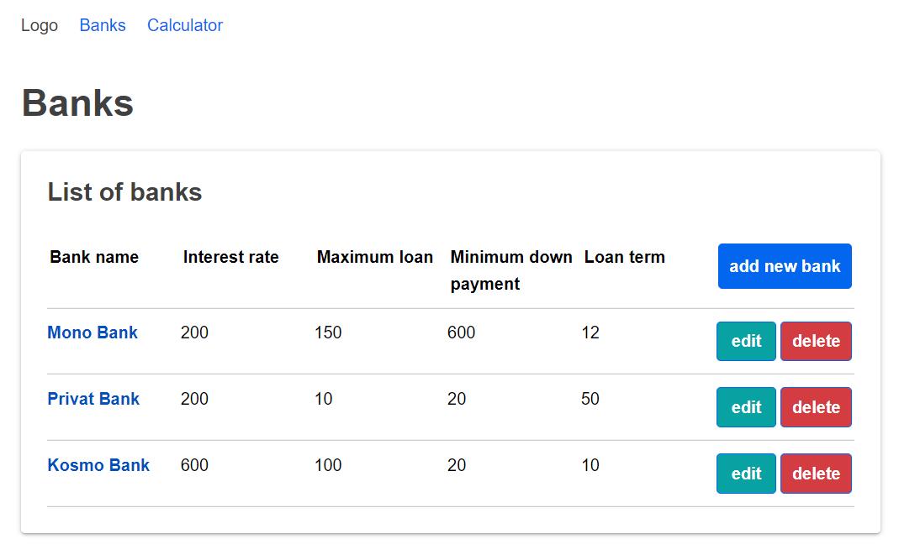
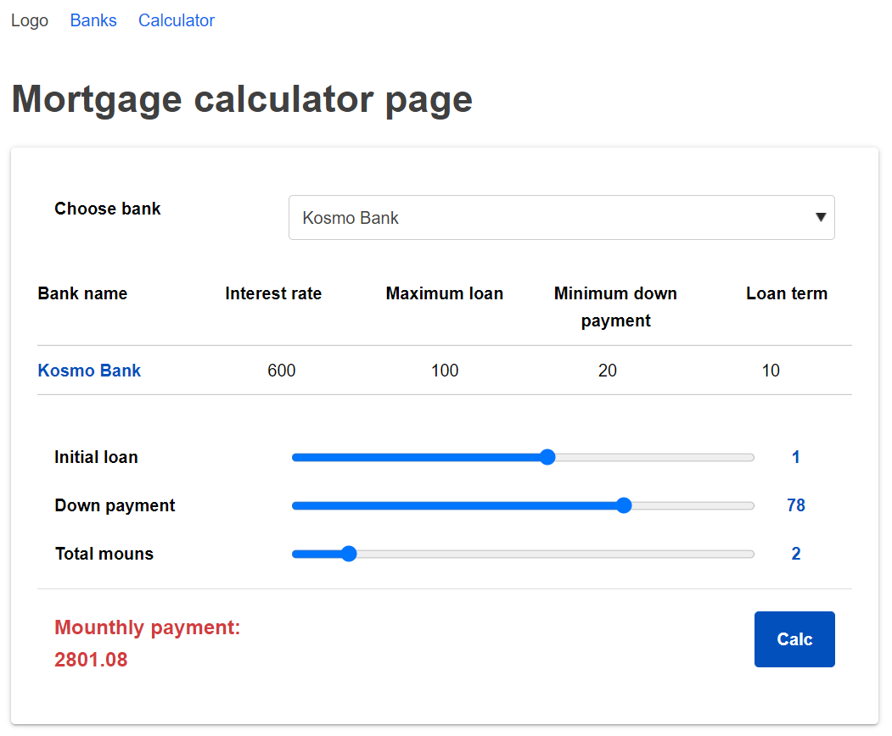

# Mortgage calculator App

Web application where users can create banks and calculate mortgagepayments using one of these bank’s settings


 
 
 

### Start the app open file in browser
```bash
index.html
```

### Deploy application in cloud platform (vercel.com)
See [Mortgage calculator App](https://mortgage-calculator-eta.vercel.app/).

### Design in figma
https://www.figma.com/file/mtpHW6Jj6d5byowgtEujBQ/ElifTech-Mortgage-Calculator?node-id=0%3A1
